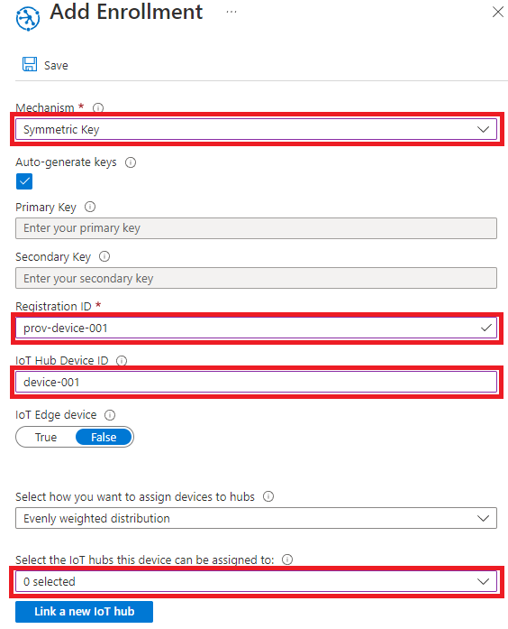
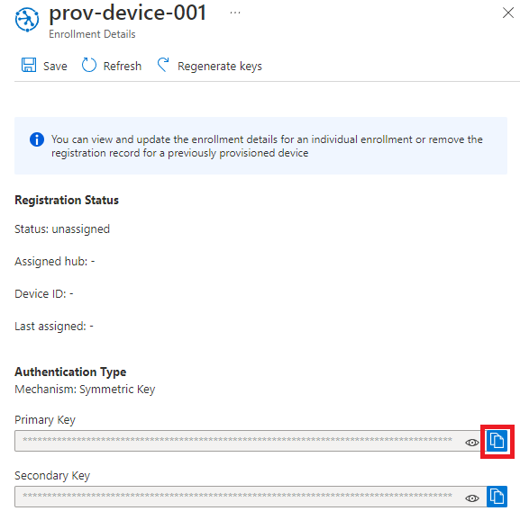
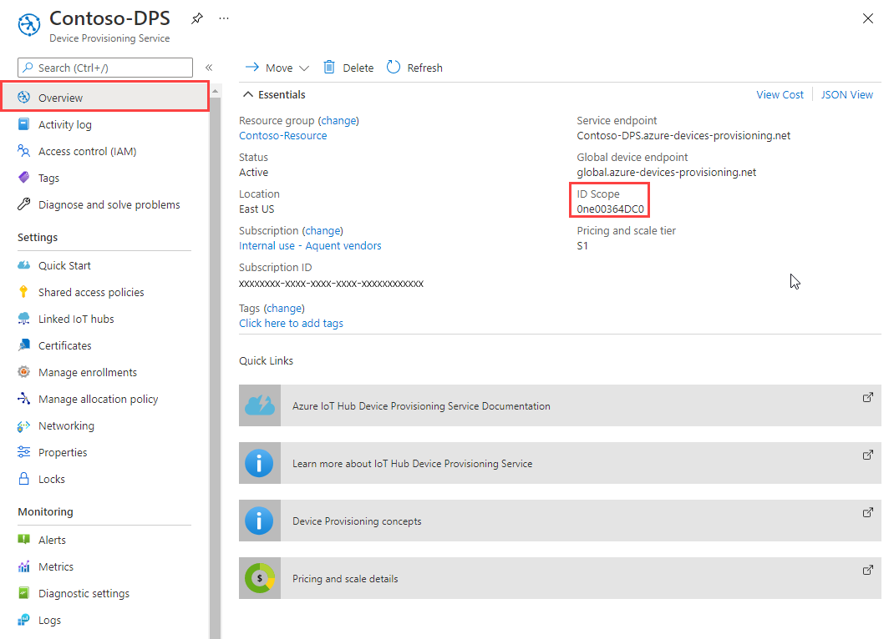
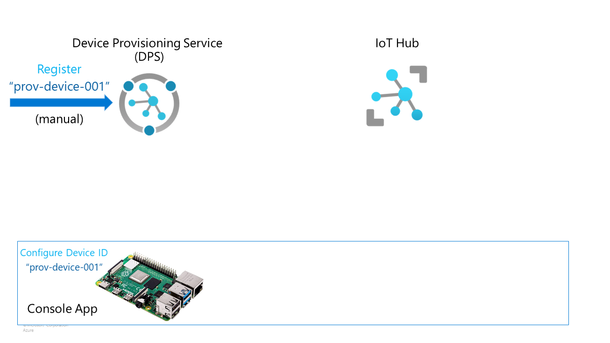
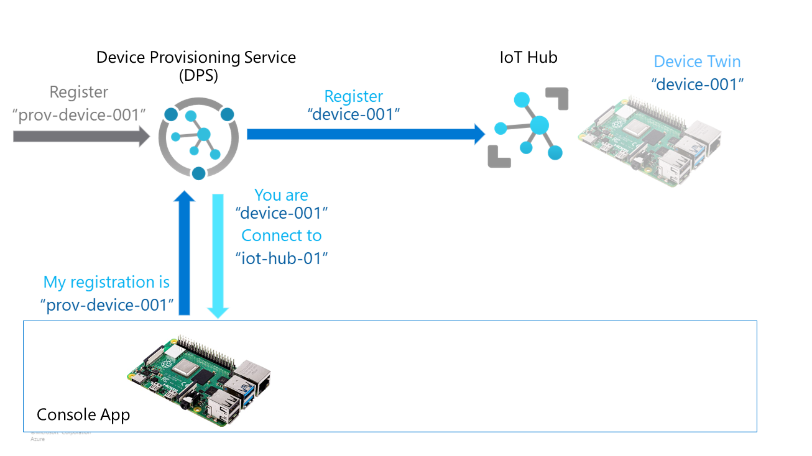
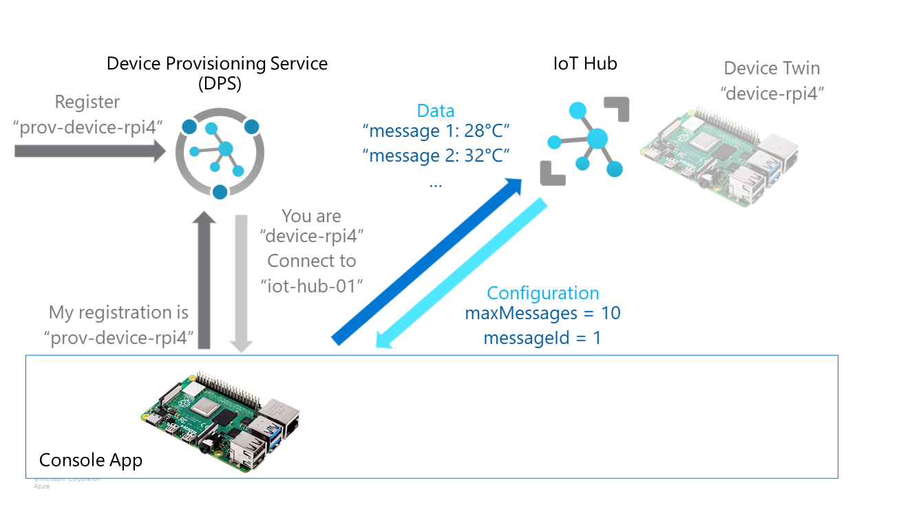

# Azure IoT Demo

This is a .NET Console App demonstrating the basic flow of Azure Device Provisioning Service (DPS), Azure IoT Hub and using Device Twins. This can be run from the console of your development machine, which will enroll the device. But you can also use this app on a Raspberry Pi, as is explained in the last part of the walkthrough.

In this demo we've been using symmetric keys, because that's easier to setup.

If you are interested in first understanding what the Azure IoT services are that are used and how they relate to each other, have a look first at this blogpost: [High-level overview of Azure IoT services (with .NET demo app) | by Martin Tirion | Feb, 2022 | Medium](https://mtirion.medium.com/high-level-overview-of-azure-iot-services-with-net-demo-app-2a2afe793adc)

## Prerequisites

* An Azure subscription
* An Azure IoT Hub and an Azure Device Provisioning Service (DPS).
  [Quickstart - Set up IoT Hub Device Provisioning Service in the Microsoft Azure portal | Microsoft Docs](https://docs.microsoft.com/en-us/azure/iot-dps/quick-setup-auto-provision)

> It is wise to create a resource group that contains all the resources, so it's easier to delete all resources at once when you're done.

## Create a device enrollment

1. Sign in to the [Azure portal](https://portal.azure.com/).
2. On the left-hand menu or on the portal page, select **All resources**.
3. In the **Add Enrollment** page, enter the following information.
   * **Mechanism**: Select *Symmetric Key* as the identity attestation Mechanism.
   * **Auto-generate keys**: Check this box.
   * **Registration ID**: Enter a registration ID to identify the enrollment. In this demo we'll be using *prov-device-001*.
   * **IoT Hub Device ID:** Enter a device identifier. In this demo we'll be using *device-001*
   * **Select the IoT hubs this device can be assigned to:** select the IoT Hub you created.
4. Select **Save**. A **Primary Key** and **Secondary Key** are generated and added to the enrollment entry, and you are taken back to the **Manage enrollments** page.
5. To view your simulated symmetric key device enrollment, select the **Individual Enrollments** tab.
6. Select your device (*prov-device-001*).
7. Copy the value of the generated **Primary Key**.
   

## Run the AzureIoTDemo Application

You can build the solution in this demo and run it using command line parameters. First you need the **ID Scope** of your DPS Service. To obtains this:

1. In the main menu of your Device Provisioning Service, select **Overview**.
2. Copy the **ID Scope** value.
   

Other information you need from the previous steps:

* The device ID **prov-device-001**
* The **device primary key** from step 10 in [Create a Device Enrollment](#create-a-device-enrollment)

This is the command line use of the demo with these parameters:

```shell
AzureIoTDemo -s [IdScope] -d prov-device-001 -k [device primary key]
```

When you build the solution, the executable is by default located in the folder `bin\Debug\net6.0`. You can also add the parameters in Visual Studio 2022 via the menu Debug > AzureIoTDemo Debug Properties > Command line arguments and click Run (or press F5).

When the application ran successfully, you can check the automatically setup device in Azure IoT Hub.

1. Select your Azure IoT Hub.
2. In the **Device Management** menu on the lieft, select **Devices**.

## Reset to run it again

If you want to see DPS in action again, just remove the *device-001* from the Devices section in your Azure IoT Hub.

1. Select your Azure IoT Hub.
2. In the **Device Management** menu on the lieft, select **Devices**.
3. Click the checkbox before **device-001** to select the device

## Explaining the general flow of DPS and IoT Hub

### Step 1. Unique ID for device and register in DPS

First step is that you device needs an unique provisioning identity to register with DPS. This can be a serial number or anything like a GUID. This ID needs to be know/accessible on the device itself and needs to be part of the image that's put on the device.

In DPS you now register this device with it's provisioning identity. You will also give it a IoT Hub identity here, which can be the same name but can also be something else ... as long as it is unique in that IoT Hub.

The configuration for a device in DPS can also have a standard configuration in the *Device Twin*. The device twin is a JSON structure available for the device in IoT Hub. A device twin can contain *Required* settings that can only be change on the server side, but read on the client device. A device twin can also contain *Reported* settings that can be changed on the client side to report back configuration. In the device twin in IoT Hub are all kinds of information added for detailed tracking like timestamps and (generated) versionnumbers.



### Step 2. Run code on the device to connect to DPS

The device needs to run code to connect to the global DPS endpoint and use the devices unique provisioning identity to register with DPS. You also need security measures in this connection like a symmetric key or (more secure) certificates.

DPS will look up the provisioning device ID and connect to the configured IoT Hub. If the device isn't registered yet with that IoT Hub, it will be registered there with the given IoT Hub device id. The DPS service will now return the IoT Hub hostname and the IoT Hub identity to the application on the device. This enables the device now to connect to the IoT Hub with his identity.



### Step 3. Connect to IoT Hub for configuration and/or sending telemetry (and more)

Now the application on the device knows the endpoint of the IoT Hub to connect to. It can read the *Device Twin* configuration if needed, and it can also report back as described.

The code can now also send and receive messages to or from the IoT Hub.



## Explaining IoT Hub Edge

IoT Hub Edge is a part of IoT Hub and offers extra management and runtime functionalities. A device can be a 'normal' device or an 'IoT Edge' device. An IoT Edge device must have the IoT Edge runtime installed (an agent and a local hub). If this device is provisioned, the IoT Edge device in the Azure portal will show more information. It will show the health of the IoT Edge runtime to start with so this can be monitored.

Once this is done, the IoT Edge runtime on the device can install, run, update and delete *IoT Edge Modules*. A module is a container which can come from the Azure marketplace, but you can also create your own custom modules. In the Azure Portal you can add, upgrade and delete modules for the device. This will be handled by the IoT Edge runtime on the device. If needed, it will download the container. It will run it and check it's health. If it crashes, the runtime makes sure it's restarted.

Each IoT Edge module has it's own *Module Identity Twin* which can contain required settings and reported settings for just the module on a device.

## Resources

This is just a high-level overview, where lots of details (like security) are skipped. But I hope it helps you to have a better understanding of these Azure IoT Services and how you can use the in your own environment or settings.

More information can be found here:

* [Azure IoT – Internet of Things Platform | Microsoft Azure](https://azure.microsoft.com/en-us/overview/iot/)
* [Quickstart - Provision a simulated symmetric key device to Microsoft Azure IoT Hub | Microsoft Docs](https://docs.microsoft.com/en-us/azure/iot-dps/quick-create-simulated-device-symm-key?pivots=programming-language-csharp)
* [Understand Azure IoT Hub device twins | Microsoft Docs](https://docs.microsoft.com/en-us/azure/iot-hub/iot-hub-devguide-device-twins)
* [Quickstart create an Azure IoT Edge device on Linux | Microsoft Docs](https://docs.microsoft.com/en-us/azure/iot-edge/quickstart-linux?view=iotedge-2020-11)
* [Create and provision an IoT Edge device on Linux using symmetric keys - Azure IoT Edge | Microsoft Docs](https://docs.microsoft.com/en-us/azure/iot-edge/how-to-provision-single-device-linux-symmetric?view=iotedge-2020-11&tabs=azure-portal%2Cubuntu)
* [Tutorial - Develop module for Linux devices using Azure IoT Edge | Microsoft Docs](https://docs.microsoft.com/en-us/azure/iot-edge/tutorial-develop-for-linux?view=iotedge-2020-11)
* [Certificates for device security - Azure IoT Edge | Microsoft Docs](https://docs.microsoft.com/en-us/azure/iot-edge/iot-edge-certs?view=iotedge-2020-11)
* [Create test certificates - Azure IoT Edge | Microsoft Docs](https://docs.microsoft.com/en-us/azure/iot-edge/how-to-create-test-certificates?view=iotedge-2020-11)
